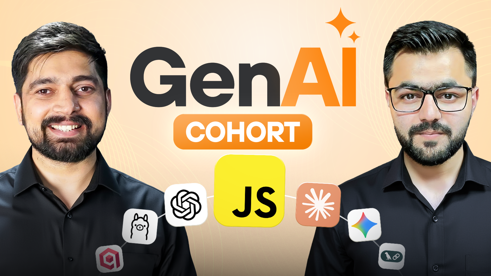

# Generative AI Cohort 2026 — Learning Journey

> **From Zero to Hero across every layer of the modern AI engineering stack.**

A repository for learning, assignments, projects, and resources for the Generative AI Cohort 2026.

---

<p align="center">
  
</p>

---
# Hi, I am **PRINCE KUMAR** 👋

Welcome to my **AI Engineering journey repository** !!

This repository documents my learning journey through **LLMs, RAG, vector databases, AI agents, memory systems, MCP, AI-powered applications, and production AI workflows**.

You’ll find:

* 📚 Learning notes
* 🧠 Concepts and explanations
* 💻 Hands-on experiments
* 🧪 Proofs of concept
* 🚀 Real-world projects
* 🛠️ Production-oriented implementations
* 💡 Engineering learnings

The focus is on learning by building real projects and understanding how modern AI systems work from fundamentals to production.

I’ll be exploring everything from **Transformers, APIs, and prompt engineering** to **RAG, vectorless retrieval, AI agents, agentic SDKs, memory systems, MCP, Skills, Plugins, and AI-powered applications** through hands-on projects.

This learning journey is part of the **Chai Aur Cohort**, an **AI engineering learning program** by **[Hitesh Choudhary](https://www.youtube.com/@chaiaurcode)** & **[Piyush Garg](https://www.youtube.com/@piyushgargdev)**, guided by their teaching and mentorship.

🌐 **Learning Platform:** [chaicode.com](https://chaicode.com/)

📖 **Syllabus:** [Click Here](https://chaicode.com/cohorts/gen-ai)

> This repository is not just a collection of code. It is a reflection of **consistency, curiosity, experimentation, and continuous improvement** as I grow as an AI engineer.

---

# 📚 What's Inside This Repository?

This repository covers the major layers of modern AI engineering:

* 🧠 LLMs & Transformers
* 🔌 AI APIs & Model Platforms
* ✍️ Prompt engineering techniques
* 💬 Streaming AI Applications
* 🔎 RAG & vector search systems
* 🗄️ Vector Databases
* 📚 Document Ingestion
* 🔍 Vectorless Retrieval Systems
* 🤖 AI Agents & Agentic Workflows
* 🧩 Agentic SDKs implementations
* 🟣 Claude & Claude Agent SDK
* 🧠 Memory Systems
* 🕸️ Knowledge Graphs
* 🌐 MCP
* 🛠️ AI Skills & Plugins
* 🚀 Production-Oriented AI Applications

---

# 🛠 Tech Stack & Tools

Standard technologies, frameworks, AI platforms, databases, infrastructure, and tools used throughout this **AI Engineering learning journey**.

<p align="left">

<!-- Languages & Runtime -->


<!-- AI Platforms & LLMs -->


<!-- AI APIs & Models -->


<!-- Prompt Engineering -->


<!-- RAG & Retrieval -->


<!-- Databases -->


<!-- AI Agents -->


<!-- Agent Tools -->


<!-- Voice & Realtime AI -->


<!-- Memory -->


<!-- MCP & AI Ecosystem -->


<!-- Documents & Data -->


<!-- Infrastructure -->


<!-- AI Engineering -->


</p>


---
# 🗺️ Roadmap Overview

This roadmap takes you from **LLM fundamentals** to production-ready AI engineering systems covering **RAG, vector databases, agents, memory, AI SDKs, MCP, and AI-powered applications**.

### Learning Journey

1. [Foundation](#foundation)
2. [AI System Design](#ai-system-design)
3. [Vectorless Indexing](#vectorless-indexing)
4. [AI Powered Projects](#ai-powered-projects)
5. [Agentic Workflows](#agentic-workflows)
6. [Agentic SDK](#agentic-sdk)
7. [Claude 101](#claude-101)
8. [Agentic AI Project](#agentic-ai-project)
9. [Memory Layer](#memory-layer)
10. [Adapting AI Ecosystem](#adapting-ai-ecosystem)
11. [Bonus](#bonus)

---

# Foundation

### Transformers

* What happens when you send a message to an LLM
* How transformers process text internally
* Tokenization and how text becomes numbers
* Attention mechanism and why it matters
* Embeddings and vector space intuition
* Context windows and what happens when you exceed them
* Temperature, top-p and how randomness is controlled

### API Platforms

* Setting up your Node.js project from scratch
* Exploring OpenAI API Dashboard
* Understanding Claude APIs
* Gemini APIs via Google AI Studio
* Reading and handling the response object
* Streaming responses end-to-end
* Running local LLMs with Ollama
* Generating embeddings on your own machine
* Picking the right model for cost, speed and quality

### Prompt Engineering

* Zero-shot prompting
* Few-shot prompting with examples
* Role prompting and personas
* Chain-of-Thought prompting
* Self-consistency technique
* ReAct prompting
* Negative prompting and setting constraints
* Getting reliable structured output like JSON
* Prompt chaining across multiple calls
* Common prompt mistakes and how to fix them

### Streaming ChatGPT Clone

* Setting up the full-stack project
* Streaming chat responses in real time
* Markdown and code block rendering
* Persisting responses to a database
* Loading and managing conversation history
* Token counting and handling context limits

---

# AI System Design

### RAG Architecture

* What RAG is and the problem it solves
* Indexing pipeline design
* Query pipeline design
* Fixed-size chunking
* Semantic chunking
* Recursive chunking
* Choosing the right chunking strategy
* Document parsing across PDFs, Markdown and HTML
* Picking the right embedding model

### Vector Search with Qdrant

* What a vector database is under the hood
* Running Qdrant locally with Docker
* Storing and querying embeddings
* Vector similarity search
* Metadata filtering for scoped results
* Reranking for better retrieval quality

### Production Ingestion

* Why ingestion should never block a web request
* Queue-based ingestion architecture
* Background workers for document processing
* Handling failures and retrying jobs safely
* Tracking ingestion progress

---

# Vectorless Indexing

### Where Vector RAG Fails

* Chunk boundary problems that destroy meaning
* Embedding drift over time
* Opaque similarity scores that mislead retrieval
* Questions that need reasoning across multiple chunks

### Vectorless Retrieval

* PageIndex retrieval without any vector database
* Building an LLM-generated wiki from your documents
* Using the wiki as an agent memory substrate
* Vector vs vectorless tradeoffs
* Hybrid strategies for real workloads
* Deciding which approach your project actually needs

---

# AI Powered Projects

### NotebookLM Clone

* Uploading and indexing user documents
* Querying across multiple documents at once
* Multi-document reasoning
* Handling large files and edge cases

### AI Pitch Deck

* Prompt to outline generation
* Outline to slides pipeline
* Structured output for consistent slide formatting
* Exporting the final deck as a downloadable file

---

# Agentic Workflows

### Agent Fundamentals

* The difference between a chain and an agent
* The perceive-decide-act loop in code
* Designing tools with strict JSON schemas
* Parallel vs sequential tool calls
* Guardrails and safe tool execution
* Retries and error recovery
* Preventing infinite loops and runaway agents

### CLI Agent from Scratch

* Building the core agent loop in plain JavaScript
* File read, write and directory tools
* Shell command execution tool
* Claude-Code-style CLI interface

---

# Agentic SDK

### OpenAI Agents SDK

* Why frameworks exist and what they save you from
* Rebuilding the CLI agent with the SDK
* Defining agents and their instructions
* Multi-agent handoffs and shared state
* Input and output guardrails
* Built-in tracing and session management

### Managed Tools & Voice

* File Search tool
* Web Search tool
* Code Interpreter tool
* How the OpenAI Realtime API works
* Building a real-time voice agent
* Handling audio input and output streams

---

# Claude 101

### Claude's Unique Primitives

* Long context window and what it makes possible
* Sending PDFs directly without any parsing
* Getting inline citations from Claude responses
* What prompt caching is and how it works
* Setting up manual prompt caching in API calls
* Measuring cost savings from caching
* Extended thinking and when to use it
* Structured tool use and output schemas
* Message batches for bulk processing

### Claude Agent SDK

* Setting up the Claude Agent SDK in Node.js
* Defining tools and writing system prompts
* Building a full agent loop end-to-end
* Managing multi-turn conversations
* Picking the right Claude model per task
* Claude vs OpenAI for agentic workloads

---

# Agentic AI Project

### AutoWiki for Git

* Repository indexing progress
* File tree explorer
* Search files/functions/classes
* Copy AI-generated docs
* Export wiki as Markdown/PDF

---

# Memory Layer

### Architecture

* Why LLMs are stateless by default
* Short-term memory and the context window
* Long-term memory stored outside the model
* Episodic memory for past interactions
* Semantic memory for facts and user knowledge
* Memory write, update and forget policies

### Implementations

* Integrating Mem0 into an existing agent
* Writing and retrieving personal memories
* What a knowledge graph is and why it fits memory
* Setting up Neo4j and connecting it to your agent
* Storing memory as nodes and relationships
* Querying connected memories across sessions
* Building a personal AI that remembers you

---

# Adapting AI Ecosystem

### MCP

* What the Model Context Protocol is
* Why MCP became the industry standard
* MCP architecture: clients, servers and transports
* Building your first MCP server
* Exposing tools through the MCP interface
* Publishing your server for others to install
* Connecting any MCP-aware client on day one

### Skills

* What a Claude Skill is
* Packaging agentic capabilities as a Skill
* Defining input and output schemas
* Distributing your Skill in the AI ecosystem

### Plugins

* How Plugins differ from Skills
* Building and registering a Plugin
* Shipping a public portfolio of everything you built

---

# Bonus

* 🏆 Bounties
* 🧠 Live Interactive Quizzes
* 💻 Hackathons
* 🤝 Project Peer Review

---

# 🎯 What You'll Learn

By completing this roadmap, you'll gain practical experience with:

* 🧠 LLMs & Transformers
* 🔌 AI APIs
* ✍️ Prompt Engineering
* 💬 Streaming AI Applications
* 🔎 RAG Architectures
* 🗄️ Vector Databases
* 📚 Document Ingestion
* 🔍 Vectorless Retrieval
* 🤖 AI Agents
* 🧩 Agentic SDKs
* 🟣 Claude
* 🧠 AI Memory Systems
* 🕸️ Knowledge Graphs
* 🌐 MCP
* 🛠️ AI Skills & Plugins
* 🚀 Production AI Systems

---

# 📈 Learning Progress

This repository is a **living record of my progress**.

As I move through the curriculum, I’ll continue adding:

* 📝 Notes
* 💻 Source Code
* 🧪 Experiments
* 🚀 Projects
* 📊 Learnings
* 🐛 Bugs and Fixes
* 💡 Engineering Insights

The goal is to document not only **what works**, but also **what fails, why it fails, and what I learned from it**.

---

# 🏗️ Real-World Projects

The core of this journey is **building real systems instead of only studying concepts**.

| Project                        | Primary Focus                            |
| ------------------------------ | ---------------------------------------- |
| 💬 **Streaming ChatGPT Clone** | LLM APIs, streaming, conversations       |
| 📚 **NotebookLM Clone**        | RAG, documents, multi-document reasoning |
| 🎨 **AI Pitch Deck**           | Structured outputs, AI pipelines         |
| 💻 **CLI Agent**               | Tool calling, agents, shell automation   |
| 📖 **AutoWiki for Git**        | Repository indexing, AI documentation    |
| 🧠 **Personal AI**             | Memory, knowledge graphs, agents         |

> Each project is designed to reinforce concepts from the roadmap while introducing new production-level challenges.
---

# 🗺️ From Learning to Building

This journey is structured around one goal: ``` Turn AI concepts into real, production-oriented engineering systems.```

```text
                  🤖 AI ENGINEERING
                         │
                         ▼
                🧠 LLM FUNDAMENTALS
                         │
                         ▼
                 🔌 AI APIs + PROMPTS
                         │
                         ▼
                💬 STREAMING APPS
                         │
                         ▼
                   🔎 RAG SYSTEMS
                         │
                         ▼
                 🗄️ VECTOR SEARCH
                         │
                         ▼
              ⚙️ PRODUCTION INGESTION
                         │
                         ▼
               🔍 VECTORLESS RETRIEVAL
                         │
                         ▼
                  🤖 AI AGENTS
                         │
                         ▼
                 🧩 AGENTIC SDKs
                         │
                         ▼
                🟣 CLAUDE + TOOLS
                         │
                         ▼
                 🧠 MEMORY SYSTEMS
                         │
                         ▼
              🌐 MCP + SKILLS + PLUGINS
                         │
                         ▼
                  🚀 PRODUCTION AI
```


# 🌟 End Goal

> **Learn AI. Understand the systems behind it. Build useful products. Ship them. Improve continuously.**

The ultimate goal is not simply to learn how to call an LLM API.

It is to understand how modern AI systems are designed and develop the engineering skills required to build:

* LLM-powered applications
* Production RAG systems
* Reliable AI agents
* Persistent memory systems
* Tool-using AI systems
* AI developer tools
* Intelligent automation
* Production-ready AI products

---

# 🚀 Build. Experiment. Ship.

>Learn  → Build → Experiment → Deploy → Improve → Repeat


The goal is simple: Turn AI knowledge into real-world engineering skills.

---

# 🤝 Contributions & Feedback

This is primarily a personal learning repository, but suggestions, feedback, and improvements are always welcome.

If you find this repository useful:

* ⭐ **Star** the repository
* 🍴 **Fork** it
* 💡 **Open an issue** with suggestions
* 🛠️ **Contribute ideas or improvements**
* 📢 **Share feedback**

---

## 🤝 Support & License

- 📝 **License**: This project is for educational purposes.
- 🙏 **Special Thanks**: Massive gratitude to the **ChaiCode** team for this incredible journey.

---

<p align="center">
  <b>Made with ❤️ by PRINCE</b><br>
  <i>Happy Coding! 🚀</i>
</p>

---